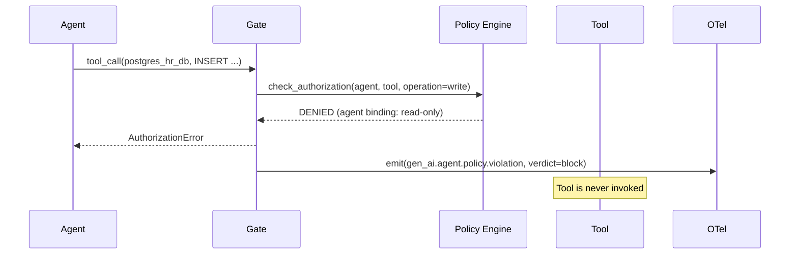

# Authorization

> **`[IMPLEMENTED]`** — Tool bindings and permission narrowing are shipped. Formal IAM composition and OPA/Rego integration are `[IN DEVELOPMENT]`.

ASL's **tool-binding authorization model** goes beyond authentication to define *what* each
agent is allowed to do with each tool. This extends the narrower authentication model provided
by protocols like A2A.

---

## The Authorization Gap

Current protocols leave a significant gap:

| Layer | What It Provides | What It Leaves Out |
|-------|-----------------|-------------------|
| OAuth / IAM | Which services an agent can access | What the agent does once connected |
| A2A | Peer-to-peer identity (mTLS, DID) | Per-operation authorization |
| MCP | Tool discovery and invocation | Behavioral governance of selections |

ASL fills this gap with **per-agent tool bindings** that declare not just *which* tools an
agent can access, but *what operations* it can perform with each tool.

---

## Tool Binding as Authorization

Every agent in ASL declares a `tools` list of `ToolBinding` references:

```yaml
# Tool declared in the catalogue with default permissions
tools:
  - name: postgres_hr_db
    type: database
    permissions: [read, write]   # default: read AND write

# Agent binding — narrows to read-only
execution:
  - name: secure_db_query
    tools:
      - name: postgres_hr_db
        permissions: [read]      # narrowed: write is not permitted
```

This is **least-privilege by default**: every agent binding is an explicit narrowing of the
tool's default permissions.

---

## Permission Types

| Permission | Description |
|------------|-------------|
| `read` | Query, retrieve, list operations |
| `write` | Insert, update, upsert operations |
| `delete` | Delete or purge operations |
| `execute` | Run code, trigger actions, invoke workflows |
| `admin` | Schema changes, access control management |

---

## Scope Monotonicity

A core invariant of ASL authorization:

> **A delegated task's scope must be a strict subset of the delegator's scope.**

A read-only orchestrator **cannot** delegate a write operation. If it attempts to do so,
the governance layer blocks the delegation.

```
Strategic (read, execute)
    │
    ├── Tactical (read)          ✓ valid — subset of strategic
    │       │
    │       └── Execution (read) ✓ valid — subset of tactical
    │
    └── Tactical (read, write)   ✗ BLOCKED — write not in strategic scope
```

---

## Governance Enforcement

Authorization violations are enforced by the behavioral envelope at the pre-execution gate:



---

## Relationship to IAM / RBAC

ASL authorization is **complementary** to, not a replacement for, existing IAM/RBAC systems:

| System | Scope | Granularity |
|--------|-------|-------------|
| AWS IAM / Azure RBAC | Infrastructure-level access | Service, resource, action |
| ASL tool bindings | Agent-level access within agentic system | Tool, operation, per-agent |
| OPA/Rego policies | Organization-level policy federation | Cross-system, declarative |

A complete authorization stack would layer all three:
1. IAM controls which cloud resources the agent runtime can reach.
2. ASL bindings control which tools each agent can use and with what permissions.
3. OPA/Rego federates policies across the entire agent estate.

---

## Open Questions

!!! note "Research"
    - How does ASL authorization compose formally with existing IAM/RBAC systems?
    - Can ASL authorization policies be expressed in standard policy languages (OPA/Rego, Cedar)?
    - What is the right authorization granularity — per-tool, per-operation, per-data-scope?

---

## See Also

- [Agent Card](agent-card.md) — per-agent identity and clearance
- [ASL → Tool Declaration](asl.md#tool-declaration)
- [Governance Contract](governance-contract.md)
- [Architecture → Security Model](../architecture.md#security-model)
