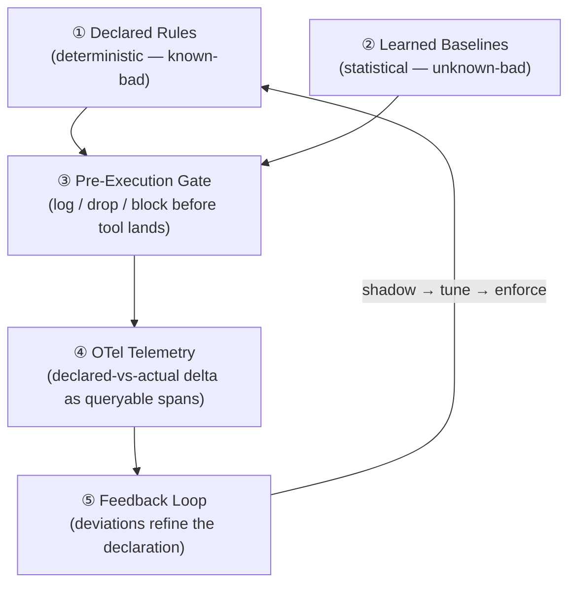

# Behavioral Envelope

> **`[IN DEVELOPMENT]`** — The enforcement runtime and scoring core are under active development.

A **Behavioral Envelope** is a deterministic enforcement boundary around a stochastic agent.
The envelope constrains what an LLM-powered agent is *allowed* to do at runtime, without
restricting what it can *reason about* internally.

---

## The Core Problem

LLM agents are stochastic: the same prompt can produce different tool selections on different
runs. Prompt-level safety instructions are requests to this stochastic system — they are not
deterministic controls.

The behavioral envelope separates the stochastic reasoning layer from the deterministic
enforcement layer:

```
┌─────────────────────────────────────┐
│         LLM Reasoning Core          │  ← stochastic (plans, generates, reasons)
└─────────────────────┬───────────────┘
                      │ tool_call(tool, args)
┌─────────────────────▼───────────────┐
│        Behavioral Envelope          │  ← deterministic (declares, scores, decides)
│                                     │
│  ① Declared rules  → known-bad      │
│  ② Learned baseline → unknown-bad   │
│                                     │
│  Verdict: log | drop | block        │
└─────────────────────────────────────┘
```

---

## Two Sources of Truth

The envelope's power comes from combining two complementary sources:

### 1. Declared Rules (Deterministic)

Rules encoded in ASL/MABaC that catch **known-bad patterns**:

- Scope violations (agent calls a tool outside its declared scope)
- Unauthorized tool selections (tool not in the agent's binding)
- Protocol breaches (skip-level delegation, unauthorized lateral communication)
- Permission violations (write call on a read-only binding)

These rules are **zero-surprise**: they are written by engineers, reviewed in PRs,
and enforced deterministically.

### 2. Learned Baselines (Statistical)

Baselines built from streaming statistics over observed agent behavior that catch
**unknown-bad patterns**:

- Novel behavioral drift (the agent starts calling tools in an unexpected order)
- Anomalies the rule-writer didn't anticipate
- Subtle changes in tool-call frequency or argument distributions

Learned baselines use streaming statistics (z-scores over rolling windows) and adapt
as agent behavior evolves — new model versions, new prompts, new data.

---

## Defense in Depth

The envelope operates as five independent layers:



Each layer is independent — a failure in the learned baseline still allows declared rules
to catch known-bad patterns, and vice versa.

---

## Scoring

The enforcement core produces a **deviation score** for each tool call:

$$
\text{score} = w_1 \cdot \text{rule\_violation} + w_2 \cdot z\text{-score}(\text{baseline})
$$

Where:
- `rule_violation` ∈ {0, 1} — whether a declared rule was triggered
- `z-score(baseline)` — how many standard deviations the observed behavior deviates from the learned baseline
- `w₁`, `w₂` — configurable weights (typically `w₁ > w₂` to prioritize declared rules)

The score is compared to per-agent thresholds to determine the enforcement verdict.

---

## Example: Envelope Configuration

```yaml
mabac:
  behavioral_envelope:
    agent: complex_operator_a
    declared_rules:
      - rule: allowed_tools_only
        enforcement: block
      - rule: scope_monotonicity
        enforcement: block
      - rule: no_skip_level_delegation
        enforcement: log
    learned_baseline:
      enabled: true
      window_seconds: 3600        # rolling 1-hour window
      min_observations: 100       # baseline is not active until 100 calls observed
      z_score_threshold: 3.0      # flag if > 3 std deviations from baseline
      enforcement: log            # baseline violations are log-only initially
    enforcement_policy:
      escalation_window_seconds: 3600
      escalate_after_violations: 5   # promote log → block after 5 violations in 1h
```

---

## Open Questions

!!! note "Research"
    The following are active research questions — not yet resolved:

    - How do baselines transfer across **model versions**? A baseline learned on GPT-4o may not apply to Claude 4.
    - How do baselines transfer across **environments**? Staging baselines may not apply to production.
    - What is the **minimum observation window** for a statistically valid baseline?

---

## See Also

- [MABaC](mabac.md) — behavioral metadata format
- [Governance Contract](governance-contract.md) — full contract lifecycle
- [Patterns → Governance Implications](../patterns/governance-implications.md)
