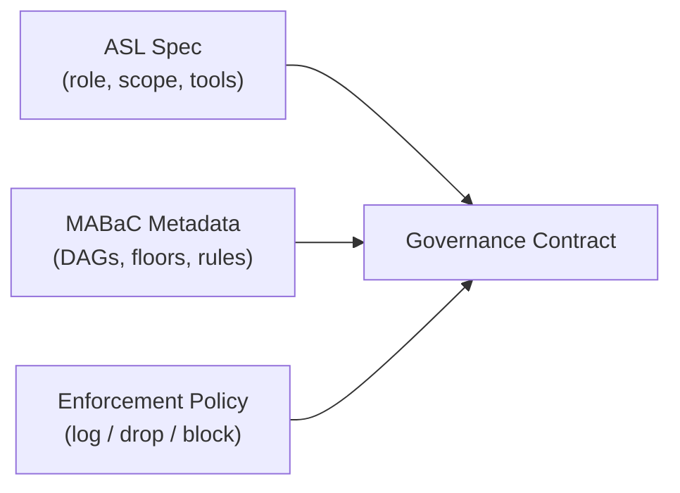
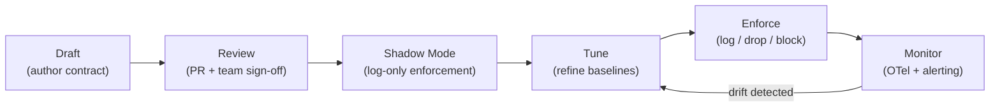

# Governance Contract

> **`[IN DEVELOPMENT]`** — Governance contract tooling and lifecycle management are under active development.

The **Governance Contract** is the version-controlled, PR-reviewable artifact that defines an
agent's behavioral expectations. It replaces opaque prompt-based safety instructions with
auditable, machine-readable specifications.

---

## What Is a Governance Contract?

In ASL terms, the governance contract is the combination of:

1. **The agent's declared role, scope, and tool bindings** — from the ASL spec.
2. **The MABaC behavioral metadata** — expected tool-selection DAGs, confidence floors, interaction rules.
3. **The enforcement policy** — log / drop / block thresholds for each rule.



---

## Why Contracts as Code?

| Traditional Approach | Governance Contract |
|---------------------|---------------------|
| Safety instructions embedded in prompts | Declarative rules in version-controlled YAML |
| Requests to a stochastic system | Deterministic, auditable controls |
| No diff history | PR-reviewable changes with full diff |
| Hard to audit | Every gate decision emitted as OTel with policy attribution |
| Framework-specific | Framework-agnostic; same contract for LangGraph, AutoGen, native Python |

---

## Contract Lifecycle



### Stages

**1. Draft** — Write the ASL spec and MABaC metadata. Define the agent hierarchy, tool bindings, and expected behavioral patterns.

**2. Review** — Open a pull request. Team members (engineers, security reviewers, compliance officers) review the contract as code — with diffs, comments, and approval gates.

**3. Shadow Mode** — Deploy with `enforcement: log` across all rules. Observe real behavior against declared expectations. Emit telemetry without blocking.

**4. Tune** — Analyse OTel data to refine confidence floors, adjust DAG expectations, and tighten or loosen scope boundaries.

**5. Enforce** — Promote rules from `log` to `drop` or `block` as confidence grows. Governance is now active.

**6. Monitor** — Continuous observation. Detected deviations trigger alerts and feed back into the tuning loop.

---

## Auditability

Every governance gate decision is emitted as an OpenTelemetry span with:

- The active contract version (git SHA or release tag)
- The policy rule that triggered the verdict
- The declared expectation vs. the observed action
- The verdict (`log` / `drop` / `block`)
- Agent identity (from the [Agent Card](agent-card.md))

This creates a queryable, policy-attributed audit trail — not just "the agent called tool X",
but "the agent called tool X, which violated rule Y in contract v1.2.3, verdict: blocked."

---

## Example

A minimal governance contract for a deterministic database query agent:

```yaml
# asl-spec.yaml
apiVersion: agent-lab.io/v1alpha1
kind: AgenticArchitecture
metadata:
  name: hr-system
spec:
  layers:
    tools:
      - name: postgres_hr_db
        type: database
        permissions: [read]
    execution:
      - name: secure_db_query
        assigned_to: hr_sub_orchestrator
        framework: native
        reasoning_type: deterministic
        tools:
          - name: postgres_hr_db
            permissions: [read]

# mabac-spec.yaml (companion)
mabac:
  workflow: hr_query
  scope_boundaries:
    - agent: secure_db_query
      allowed_tool_types: [database]
      allowed_operations: [read]
      blocked_patterns:
        - tool_type: code_exec
  interaction_rules:
    - rule: scope_monotonicity
      enforcement: block
  enforcement_policy:
    default: log
    escalate_after: 5          # promote to drop after 5 violations in 1h
```

---

## See Also

- [ASL](asl.md) — structural specification
- [MABaC](mabac.md) — behavioral metadata
- [Behavioral Envelope](behavioral-envelope.md) — declared + learned baseline
- [Agent Card](agent-card.md) — per-agent identity attribution
