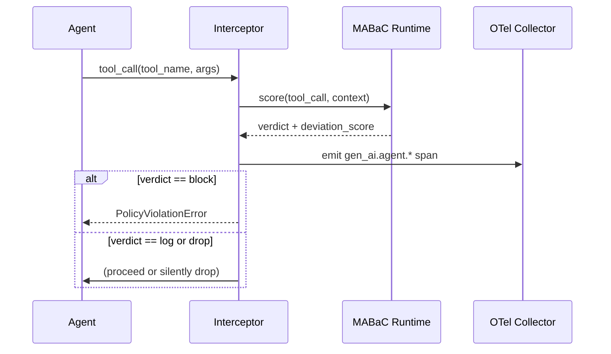

# MABaC — Multi-Agent Behavior as Code

> **`[IN DEVELOPMENT]`** — MABaC schema and runtime hooks are under active development.

MABaC is a **behavioral metadata extension to ASL** that encodes expected multi-agent interaction
patterns as machine-readable, version-controlled specifications. Where ASL defines *structure*,
MABaC defines *expected behavior*.

---

## Why MABaC?

An ASL spec tells you *who* the agents are and *what tools* they can access.
It does not tell you *how* they should behave at each workflow step.

MABaC fills this gap by encoding:

- The **expected sequence** of tool calls for a given workflow
- The **confidence thresholds** below which a tool selection should be flagged
- The **interaction rules** that govern delegation and escalation
- The **scope boundaries** that define normal versus anomalous behavior

This metadata is consumed at runtime by the observation and enforcement layer to
measure behavioral deviations and generate policy-attributed telemetry.

---

## MABaC Concepts

### Expected Tool-Selection DAGs

For each workflow step, MABaC declares the anticipated sequence and structure of tool calls:

```yaml
mabac:
  workflow: hr_onboarding
  steps:
    - id: fetch_employee_data
      agent: hr_sub_orchestrator
      expected_tools:
        - postgres_hr_db
      max_deviation_score: 0.2

    - id: generate_report
      agent: report_generator
      expected_tools:
        - report_template_tool
        - postgres_hr_db
      allowed_alternatives:
        - document_store
      max_deviation_score: 0.3
```

### Confidence Floors

Minimum confidence thresholds below which a tool selection triggers a governance action:

```yaml
mabac:
  confidence_floors:
    global: 0.7              # applies to all agents unless overridden
    per_agent:
      - agent: anomaly_detector
        floor: 0.85          # higher confidence required for safety-critical agent
```

### Interaction Rules

How agents should delegate, escalate, and coordinate:

```yaml
mabac:
  interaction_rules:
    - rule: no_skip_level_delegation
      description: Agents may only delegate to the layer immediately below
      enforcement: block

    - rule: scope_monotonicity
      description: Delegated scope must be a subset of delegator scope
      enforcement: block

    - rule: lateral_coordination_requires_declaration
      description: Lateral agent communication must be declared in ASL
      enforcement: log
```

### Scope Boundaries

The operational envelope within which an agent's behavior is considered normal:

```yaml
mabac:
  scope_boundaries:
    - agent: secure_db_query
      allowed_tool_types: [database]
      allowed_operations: [read]
      blocked_patterns:
        - tool_type: code_exec
        - tool_type: file_system
```

---

## Enforcement Policy

Each rule or boundary can carry one of three enforcement verdicts:

| Verdict | Behavior |
|---------|----------|
| `log` | Emit telemetry; allow the operation |
| `drop` | Silently drop the operation; emit telemetry |
| `block` | Reject the operation; return error to agent; emit telemetry |

The enforcement ladder — `log → drop → block` — supports a **shadow mode workflow**:
observe first, tune baselines, then graduate to enforcement.

---

## Runtime Integration

At runtime, MABaC metadata is consumed by the governance layer:



---

## Relationship to ASL

MABaC extends ASL — a complete governance artifact includes both:

| ASL | MABaC |
|-----|-------|
| Who the agents are | How they should behave |
| Which tools they can access | Which tool sequences are expected |
| What permissions they hold | What confidence levels are required |
| Structural topology | Behavioral envelope |

Together they form the [Governance Contract](governance-contract.md).

---

## See Also

- [Governance Contract](governance-contract.md)
- [Behavioral Envelope](behavioral-envelope.md)
- [ASL](asl.md)
- [Taxonomy → Governance Levels](../taxonomy/governance-levels.md)
