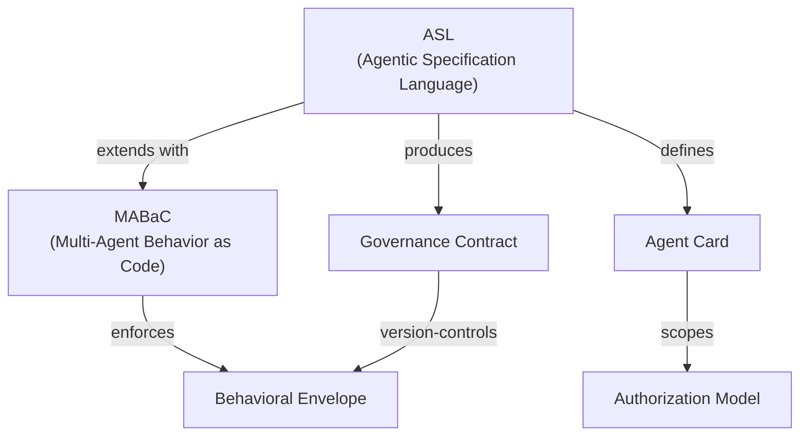

---
hide:
  - navigation
---

# agentic-lab

[](https://github.com/graphsentinel/agentic-lab/actions)
[](https://pypi.org/project/agentic-lab/)
[](https://github.com/graphsentinel/agentic-lab/blob/main/LICENSE-2.0.txt)
[](https://pypi.org/project/agentic-lab/)

**Declarative agentic workflow architecture and automated code/container generation.**

agentic-lab lets you define complex multi-agent systems in YAML using the
**Agent Specification Language (ASL)**, then generate framework-specific
Python code, Dockerfiles, and Kubernetes manifests.

---

## Key Features

<div class="grid cards" markdown>

- :material-file-code: **Declarative ASL**

    Kubernetes-style YAML for agentic architectures — version-controlled, PR-reviewable governance contracts.

- :material-layers-triple: **Four-Tier Hierarchy**

    Tools catalogue + Strategic + Tactical + Execution layers with explicit delegation and scope monotonicity.

- :material-shield-check: **Security Governance**

    Agent Cards with clearance levels, PII scrubbing, audit retention, and deterministic fallback.

- :material-cog-sync: **Code Generation**

    LangChain/LangGraph and native Python adapters with an extensible generator registry.

- :material-access-point: **Edge Deployment**

    Cloud-to-edge model sync (OCI pull), offline inference, ONNX/GGUF model artifacts.

- :material-protocol: **Protocol Models**

    A2A (gRPC+mTLS), MCP (sandboxed sidecar), CloudEvents — framework-agnostic by design.

</div>

---

## Quick Start

=== "PyPI"

    ```bash
    pip install agentic-lab
    ```

=== "Source"

    ```bash
    git clone https://github.com/graphsentinel/agentic-lab.git
    cd agentic-lab
    pip install -e ".[dev]"
    ```

Once installed, scaffold, validate, and generate in three commands:

```bash
# Scaffold a new project
agentlab init my-project --template centralized

# Validate an ASL spec
agentlab validate examples/centralized_enterprise.yaml

# Generate code and manifests
agentlab generate examples/centralized_enterprise.yaml --output-dir ./output
```

---

## Architecture Overview

agentic-lab uses a **four-tier model**: a shared Tools Catalogue plus three agent layers.

```
Tools Catalogue (shared)           Reusable capabilities, declared once
    │
    ├── Strategic Layer            Global orchestrators (LLM-powered planning)
    │       │
    │       ├── Tactical Layer     Domain sub-orchestrators (HR, Finance, etc.)
    │       │       │
    │       │       ├── Execution Layer
    │       │       │       ├── Simple Operators   (deterministic, zero hallucination)
    │       │       │       └── Complex Operators   (LLM, ML, GraphRAG)
```

See [Architecture](architecture.md) for the full reference, and [Concepts → ASL](concepts/asl.md) to understand the specification language.

---

## Examples

| Example | Template | Description |
|---------|----------|-------------|
| [`centralized_enterprise.yaml`](reference/examples.md#centralized-enterprise) | Centralized | Enterprise HR/Finance/IT with LLM orchestrator |
| [`distributed_mesh.yaml`](reference/examples.md#distributed-mesh) | Distributed | Supply-chain mesh with peer negotiation |
| [`edge_agent_workflow.yaml`](reference/examples.md#edge-predictive-maintenance) | Centralized (Edge) | Factory-floor predictive maintenance on K3s |

---

## Concept Map



---

## Project Status

!!! note "Alpha"
    agentic-lab is currently at **v0.1.0-alpha**. The ASL schema, generator adapters, and CLI are functional and tested. MABaC behavioral metadata and the observation/enforcement runtime are on the roadmap.

---

*Apache 2.0 · [graphsentinel/agentic-lab](https://github.com/graphsentinel/agentic-lab)*  
*Zeyno Aygen Dodd · Mustafa Dayioglu*
