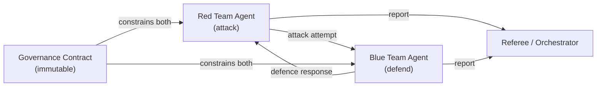
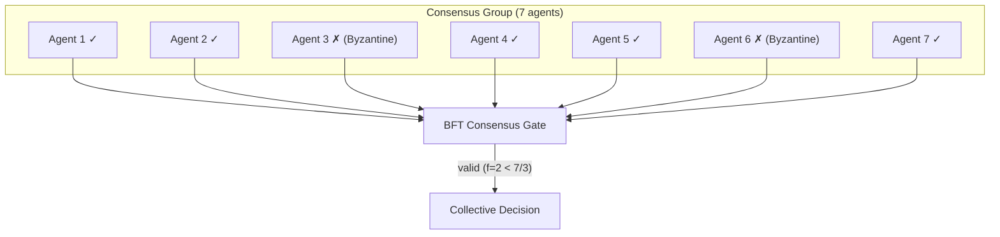

# Adversarial Patterns

> **`[RESEARCH]`** — Adversarial patterns are documented as vision-scope content for community feedback.

Adversarial patterns describe multi-agent systems where agents have competing objectives
or operate in untrusted environments where some agents may be compromised.

---

## Pattern Overview

| Pattern | Description | Primary Use |
|---------|-------------|------------|
| **Red Team / Blue Team** | One agent attacks; another defends | Security testing, robustness evaluation |
| **Competitive Bidding** | Agents bid for task assignment based on capability and cost | Resource allocation, market simulations |
| **Adversarial Validation** | One agent generates; another critiques | Hallucination detection, quality assurance |
| **Byzantine Agents** | Some agents may be compromised; system must function despite failures | High-security, distributed environments |

---

## Red Team / Blue Team

A security pattern where one agent (red team) attempts to find vulnerabilities while
another (blue team) defends — both constrained by governance contracts.



**Key governance property**: The governance contract constrains *both* agents. The red team
cannot escalate to destructive actions outside its declared scope, and the blue team's
defences must be auditable.

**Use cases**:
- Automated penetration testing within a defined scope
- Evaluating agent robustness to adversarial inputs
- Security posture validation before production deployment

---

## Competitive Bidding

Agents bid for task assignment based on their declared capabilities and cost. A central
allocator (or peer consensus) assigns tasks to the winning bidder.

```
Task → [Allocator] → broadcast(task, requirements)
            ↑
    [Agent A] bid(capability=0.9, cost=0.3)
    [Agent B] bid(capability=0.7, cost=0.1)
    [Agent C] bid(capability=0.95, cost=0.8)
            ↓
    Allocator selects Agent C (highest capability within budget)
```

**Governance considerations**:
- Bids must be verifiable — a governance contract prevents agents from claiming capabilities they don't have
- Allocation decisions must be auditable — which agent was selected and why
- Budget constraints are scope boundaries — the allocator cannot assign tasks that exceed the declared budget

---

## Adversarial Validation

One agent generates output; another critiques it. The governance contract ensures the
critic cannot be co-opted by the generator.

```
Input → [Generator] → output → [Critic] → verdict
                                    ↓
                            accept | reject | flag
```

**Key governance property**: The critic must be **independent** of the generator. If they
share a model, inference environment, or API key, the critic can be influenced by the
generator. Agent Cards with separate identities and clearance levels enforce independence.

**Use cases**:
- Hallucination detection (critic checks factual consistency)
- Code quality assurance (critic reviews generated code)
- Compliance checking (critic validates output against policy)

---

## Byzantine Agents

In distributed or federated deployments, some agents may be compromised, malfunctioning,
or acting in bad faith. The system must function correctly despite a bounded number of
Byzantine agents.

**Byzantine fault-tolerant (BFT) properties** required:
- The system reaches a valid decision if at most `f` out of `3f+1` agents are Byzantine
- No single agent can unilaterally corrupt the collective decision
- The governance layer detects Byzantine behavior via anomaly scoring and excludes bad actors



!!! note "Research"
    Byzantine fault-tolerant consensus for agent networks is in the
    [Vision → Gossip, DHT & Consensus](../vision/gossip-dht-consensus.md) research scope.

---

## See Also

- [Collaborative Patterns](collaborative.md) — patterns with shared objectives
- [Governance Implications](governance-implications.md) — how adversarial patterns shape governance
- [Vision → Gossip, DHT & Consensus](../vision/gossip-dht-consensus.md) — BFT research
- [Concepts → Behavioral Envelope](../concepts/behavioral-envelope.md) — anomaly detection
