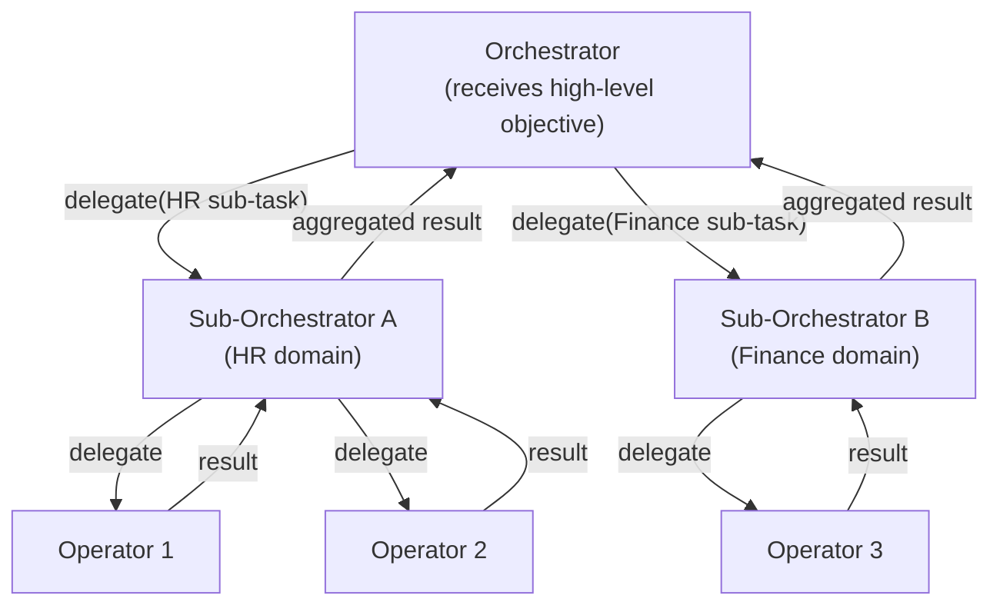

# Collaborative Patterns

> **`[PILOT-VALIDATED]`** — Task decomposition and pipeline chaining are validated. Ensemble consensus and shared memory are `[IN DEVELOPMENT]`.

Collaborative patterns describe multi-agent systems where agents share a common objective
and cooperate toward a shared outcome.

---

## Pattern Overview

| Pattern | Description | Primary Topology |
|---------|-------------|-----------------|
| **Task Decomposition** | Orchestrator breaks objective into sub-tasks and delegates | Pyramid |
| **Pipeline Chaining** | Agents execute in sequence; each transforms the previous output | Pyramid |
| **Ensemble Consensus** | Multiple agents independently analyse the same input; results are aggregated | Both |
| **Shared Memory / Blackboard** | Agents read from and write to a common state store | Both |

---

## Task Decomposition and Delegation

The primary pattern in ASL's [pyramid topology](../topologies/pyramid.md).



**Governance considerations**:
- Scope monotonicity must hold at every delegation edge
- The orchestrator's result aggregation must not exceed its declared scope
- Silent failures in sub-tasks must be surfaced (not swallowed)

---

## Pipeline Chaining

Agents execute in a fixed sequence. Each agent receives the output of the previous stage
as its input and transforms it.

```
Input → [Agent A] → [Agent B] → [Agent C] → Output
```

**Example**: Document processing pipeline
```
raw_text → [Extractor] → structured_data → [Analyser] → insights → [Reporter] → report
```

**Governance considerations**:
- Each stage must be governed independently — a compromised middle stage can poison downstream outputs
- Per-stage behavioral envelopes catch silent failures (an agent that passes bad data forward)
- Pipeline integrity checks (schema validation between stages) detect data quality issues

---

## Ensemble Consensus

Multiple agents independently analyse the same input. Results are aggregated via voting,
weighted averaging, or best-of-N selection.

```
Input ──┬──→ [Agent A] ──┬──→ Aggregator → Consensus Output
        ├──→ [Agent B] ──┤
        └──→ [Agent C] ──┘
```

**When to use**:
- High-stakes decisions where a single agent's error is unacceptable
- Detecting hallucinations (low agreement between agents signals uncertainty)
- Combining agents with different specialisations (e.g., different RAG retrievers)

**Governance considerations**:
- Aggregator must be governed — it can be a single point of failure even if individual agents are correct
- Ensemble agreement score is a useful behavioral signal (unexpected low agreement triggers a MABaC alert)

---

## Shared Memory / Blackboard

Agents read from and write to a common state store, enabling asynchronous collaboration
without direct agent-to-agent communication.

```
[Agent A] ──write──→ ┌─────────────┐ ←──read── [Agent C]
[Agent B] ──write──→ │  Blackboard │
                      │  (shared    │ ──read──→ [Agent D]
                      │   state)    │
                      └─────────────┘
```

**Governance considerations**:
- Write permissions to the blackboard must be declared in ASL (tool binding with `write` permission)
- Read-modify-write cycles are potential race conditions in concurrent agent systems
- The blackboard itself is a high-value governance target — all writes should be attributable to a specific Agent Card

---

## See Also

- [Adversarial Patterns](adversarial.md) — patterns with competing objectives
- [Governance Implications](governance-implications.md) — how patterns shape governance design
- [Topologies → Pyramid](../topologies/pyramid.md) — the primary collaborative topology
- [Taxonomy → Interaction Patterns](../taxonomy/interaction-patterns.md)
