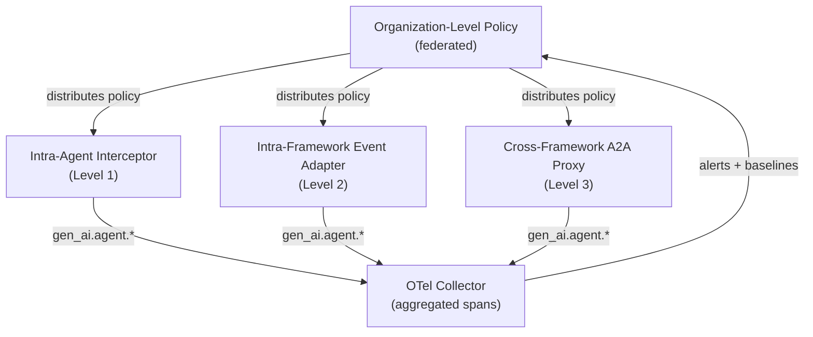

# Governance Levels

> **`[IMPLEMENTED]`** — Intra-agent governance is shipped. Inter-agent and organization-level governance are `[IN DEVELOPMENT]`.

Governance in agentic-lab operates at four distinct levels, each with its own scope and enforcement seat.

---

## Level Summary

| Level | Scope | Enforcement |
|-------|-------|-------------|
| **Intra-agent** | One agent's tool-call chain | Interceptor / proxy on the tool path |
| **Inter-agent (intra-framework)** | Delegation graph within one framework | Event adapter on native delegation |
| **Inter-agent (cross-framework)** | Delegation across framework boundaries | A2A proxy at trust boundaries |
| **Organization-level** | Policies spanning the entire agent estate | Governance mesh / policy federation |

---

## Level 1 — Intra-Agent

**Scope**: A single agent's sequence of tool calls within one workflow step.

**What is governed**:
- Which tools the agent selected (vs. declared)
- In what order (vs. expected DAG)
- With what arguments (vs. input schema)
- Resulting in what output (vs. output schema)

**Enforcement seat**: An interceptor or proxy sits on the tool invocation path, scoring
each call against declared rules and learned baselines before the tool executes.

```
Agent → [Interceptor] → Tool
              ↓
        deviation score
              ↓
        log | drop | block
```

**Telemetry**: `gen_ai.agent.tool.call` spans with policy attribution.

---

## Level 2 — Inter-Agent (Intra-Framework)

**Scope**: The delegation graph between agents within a single framework (e.g., a LangGraph workflow).

**What is governed**:
- Which agent delegated to which (vs. `delegates_to` in ASL)
- Whether scope was narrowed on delegation (scope monotonicity)
- Whether lateral communication was authorized
- Result aggregation integrity

**Enforcement seat**: An event adapter hooks into the framework's native delegation mechanism
(LangGraph state transitions, AutoGen message passing) and emits normalized events to the
governance core.

**Telemetry**: `gen_ai.agent.delegation` spans showing the full delegation graph.

---

## Level 3 — Inter-Agent (Cross-Framework)

**Scope**: Delegation and communication across framework boundaries (e.g., a LangGraph orchestrator
delegating to a native Python operator, or a Python agent calling an agent running in a different process).

**What is governed**:
- Cross-framework delegation integrity
- Trust boundary enforcement (Agent Card identity verification)
- Protocol compliance (A2A gRPC+mTLS, DID)

**Enforcement seat**: An A2A proxy sits at each trust boundary, authenticating agent identity
and applying the governance policy before forwarding the delegation.

```
Framework A → [A2A Proxy] → Framework B
                  ↓
         Agent Card verification
                  ↓
         policy check (scope, authorization)
                  ↓
              forward | block
```

---

## Level 4 — Organization-Level { #level-4-organization-level }

**Scope**: Policies spanning the entire agent estate — multiple teams, frameworks, deployment
environments, and potentially multiple organizations.

**What is governed**:
- Federated policy consistency (same rule applied across all deployments)
- Cross-team agent identity and accountability
- Regulatory compliance (SOX, HIPAA, GDPR) across the entire estate
- Policy version management and rollout

**Enforcement seat**: A governance mesh / policy federation service that distributes policy
updates to all governance cores in the estate and aggregates telemetry centrally.

!!! note "Research"
    Organization-level governance and cross-org federation are `[RESEARCH]` scope.
    See [Vision → Federation](../vision/federation.md).

---

## Governance Level Composition

In a real deployment, all four levels operate simultaneously:



---

## See Also

- [Behavioral Envelope](../concepts/behavioral-envelope.md) — enforcement mechanism at each level
- [Communication Protocols](communication-protocols.md) — protocols used at each level
- [Vision → Federation](../vision/federation.md) — organization-level governance research
