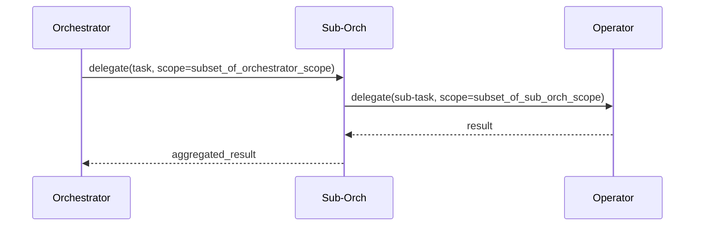

# Interaction Patterns

> **`[PILOT-VALIDATED]`** — Delegation and reporting are validated in the centralized enterprise example. Lateral coordination, escalation, broadcast, and consensus are `[IN DEVELOPMENT]`.

This page defines the interaction types between agents in a multi-agent system.

---

## Interaction Type Summary

| Pattern | Direction | Description | Example |
|---------|-----------|-------------|---------|
| **Delegation** | Top-down | Task assignment with scope narrowing | Orchestrator → Sub-orchestrator |
| **Reporting** | Bottom-up | Result / status propagation | Operator → Sub-orchestrator |
| **Lateral Coordination** | Same-layer | Context sharing or negotiation | Sub-orch A ↔ Sub-orch B |
| **Escalation** | Bottom-up (skip) | Request for broader authority | Operator → Orchestrator |
| **Broadcast** | One-to-many | Notification without delegation | Monitor → all agents |
| **Consensus** | Multi-agent | Agreement on a shared decision | Peer agents in mesh |
| **Conflict Resolution** | Multi-agent | Resolving competing claims | Orchestrator arbitration |

---

## Delegation



**Rules**:
- Delegation flows **downward only** — an agent may only delegate to agents in the layer immediately below it, unless explicitly authorized otherwise.
- **Scope monotonicity** — the delegated task scope must be a subset of the delegator's scope. A read-only orchestrator cannot delegate a write operation.
- Delegation relationships must be **declared in ASL** via `delegates_to`.

---

## Reporting

The reverse flow of delegation: results, status, and anomalies propagate upward through the hierarchy.

**Rules**:
- Reporting flows **upward only** under normal operation.
- An operator reports to its assigned sub-orchestrator; it does not report directly to the strategic orchestrator (unless escalating).

---

## Lateral Coordination

Agents at the same layer sharing context or negotiating without involving the layer above.

```yaml
# Must be explicitly declared in ASL:
tactical:
  - name: hr_sub_orchestrator
    lateral_peers:
      - finance_sub_orchestrator   # lateral communication authorized

  - name: finance_sub_orchestrator
    lateral_peers:
      - hr_sub_orchestrator
```

!!! warning "Governance implication"
    Undeclared lateral communication is a **protocol breach** and triggers a block verdict in the enforcement layer.

---

## Escalation

A bottom-up skip-level request for broader authority or a decision outside the agent's scope.

**When it occurs**:
- An operator encounters a situation that exceeds its declared scope
- A sub-orchestrator needs a strategic-level decision
- A conflict cannot be resolved at the current layer

**Governance**: Escalation must be declared as a permitted interaction in MABaC. Unapproved
skip-level delegations are blocked.

---

## Broadcast

A one-to-many notification pattern where a Monitor emits an alert to all agents or a
specified group, without creating a delegation relationship.

```yaml
# Example CloudEvent broadcast from a monitor
{
  "specversion": "1.0",
  "type": "agent.monitor.alert",
  "source": "urn:agent:graphsentinel:hr-system:system-monitor",
  "data": {
    "severity": "warning",
    "message": "Deviation score threshold exceeded for secure_db_query",
    "agent_id": "urn:agent:graphsentinel:hr-system:secure-db-query"
  }
}
```

---

## Consensus

Multi-agent agreement on a shared decision. Used primarily in [mesh topologies](../topologies/mesh.md)
where agents have competing objectives or must coordinate without a central orchestrator.

!!! note "Research"
    Consensus-driven routing and Byzantine fault-tolerant agreement mechanisms are in the
    [Vision → Gossip, DHT & Consensus](../vision/gossip-dht-consensus.md) research scope.

---

## Conflict Resolution

Resolution of competing claims or contradictory results from peer agents.

| Resolution Strategy | Description | When to Use |
|--------------------|-------------|-------------|
| **Orchestrator arbitration** | The orchestrator above makes the final decision | Hierarchical topologies |
| **Deterministic fallback** | A rule-based fallback agent resolves the conflict | Safety-critical paths |
| **Voting / best-of-N** | Majority vote across agent ensemble | Ensemble patterns |

---

## See Also

- [Roles](roles.md) — which roles participate in each pattern
- [Governance Levels](governance-levels.md) — where enforcement applies
- [Patterns → Collaborative](../patterns/collaborative.md)
- [Patterns → Adversarial](../patterns/adversarial.md)
