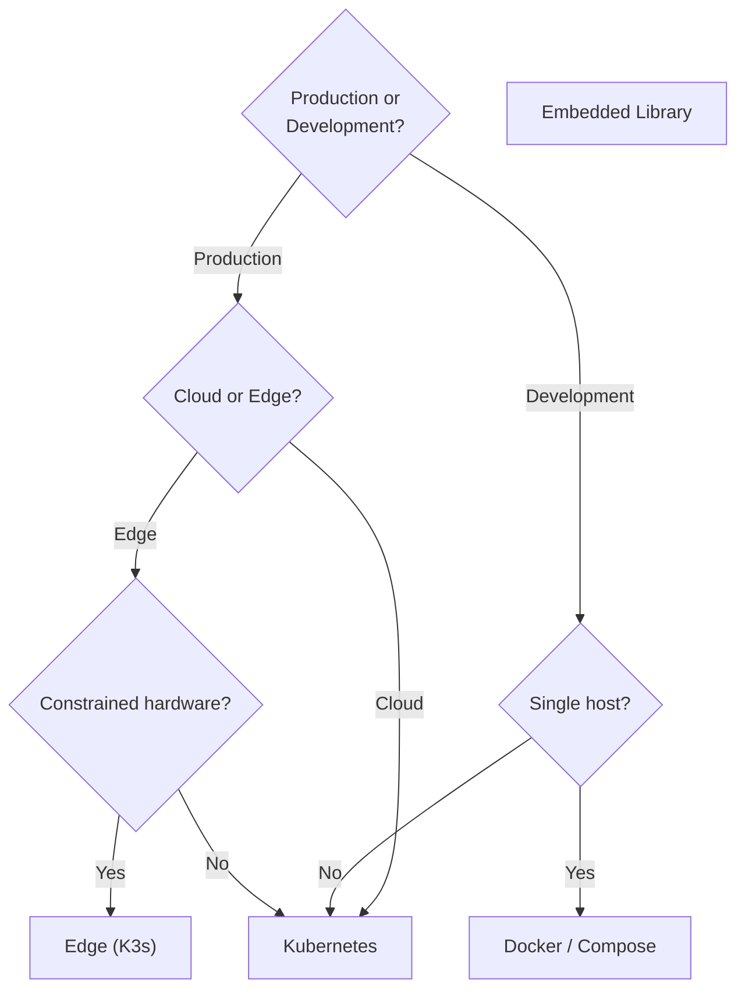

# Deployment Targets

> **`[IMPLEMENTED]`** — Kubernetes and Docker targets are shipped. Edge and embedded library targets are `[PILOT-VALIDATED]`.

agentic-lab generates deployment artifacts for four target environments from a single ASL spec.

---

## Target Summary

| Target | Declaration | Enforcement | Observability |
|--------|------------|-------------|--------------|
| **Kubernetes** | CRD reconciled by operator | MCP proxy / sidecar | OTLP → in-cluster collector |
| **Docker / Compose** | Mounted YAML file | Proxy as compose service | OTLP → compose collector |
| **Edge (K3s)** | Mounted YAML, optional cloud sync | In-process library | OTLP or local logs |
| **Embedded / Library** | Policy as Python object | `score_chain()` in-process | OTLP exporter or logs |

---

## Kubernetes

The primary production target for enterprise pyramid deployments.

```yaml
spec:
  target_deployment: kubernetes
```

**What gets generated**:
- `Deployment` manifests for each agent
- `Service` manifests for A2A gRPC endpoints
- `ConfigMap` containing the ASL spec (mounted into the governance sidecar)
- MCP sidecar `Deployment` for sandboxed tool containers
- SPIFFE/SPIRE workload identity configuration for mTLS

**Enforcement seat**: An MCP proxy sidecar runs alongside each agent container. It intercepts
tool calls, applies the governance policy, and emits OTel spans.

**Observability**: OpenTelemetry Collector deployed as a `DaemonSet` or `Deployment`; spans
shipped to your preferred backend (Grafana, Datadog, Honeycomb, etc.).

---

## Docker / Compose

Development and single-host deployment target.

```yaml
spec:
  target_deployment: docker   # or: hybrid (K8s + edge)
```

**What gets generated**:
- `Dockerfile` per agent
- `docker-compose.yml` with all agent services
- Governance proxy as a compose service
- OTLP collector as a compose service

```bash
agentlab generate examples/centralized_enterprise.yaml \
  --framework langchain_python \
  --output-dir ./output

cd ./output
docker compose up
```

---

## Edge (K3s)

For agents running on constrained hardware — factory floors, retail endpoints, edge IoT nodes.

```yaml
spec:
  architecture_template: centralized
  target_deployment: edge

  edge_sync:
    enabled: true
    transport: oci-pull
    interval_seconds: 3600
    registry: "oci://models.example.com/edge"
    verify_signature: true
    rollback_on_failure: true
```

**What gets generated**:
- Lightweight K3s manifests
- Edge-optimised agent containers (no GPU dependency)
- Model artifact sync configuration (ONNX, GGUF)
- Local OTel exporter (falls back to log files when offline)

**Cloud-to-edge sync**: Model artifacts and workflow graphs are pulled from OCI/S3 registries
on a configurable interval. Signature verification (cosign / notary) prevents tampered
artifacts from landing on the edge node. Automatic rollback triggers if the new artifact
fails the post-pull health check.

See [Examples → Edge Predictive Maintenance](../reference/examples.md#edge-predictive-maintenance)
for a complete factory-floor example.

---

## Embedded / Library

For applications that embed the governance layer in-process, without a separate sidecar.

```python
from agent_lab import GovernancePolicy, score_chain

policy = GovernancePolicy.from_yaml("my-spec.yaml")

# In your agent's tool-call loop:
verdict = score_chain(policy, agent_id="secure_db_query", tool_call=call)
if verdict == "block":
    raise PolicyViolationError(f"Tool call blocked: {call.tool}")
```

**When to use**: Testing, development, resource-constrained environments where a sidecar
is too heavy, or when the agent runtime does not support container injection.

---

## Choosing a Target



---

## See Also

- [Architecture → CLI](../architecture.md#cli) — generate command reference
- [Examples](../reference/examples.md) — full YAML examples for each target
- [Topologies → Pyramid](pyramid.md) — the primary production topology
- [Topologies → Mesh](mesh.md) — distributed / edge topology
