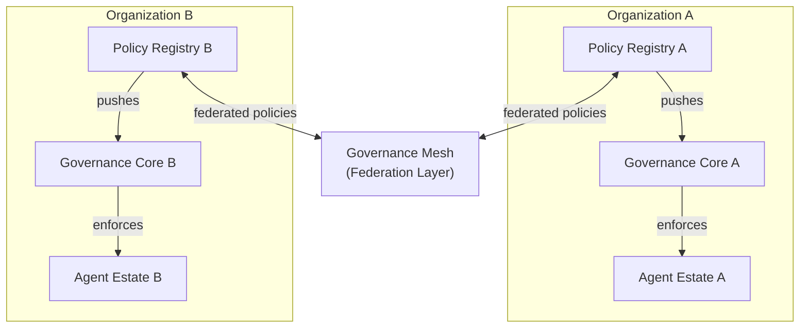

# Federation

> **`[RESEARCH]`** — Cross-organizational governance federation. Not currently implemented.

Federation extends agentic-lab governance beyond a single organization or deployment environment,
enabling consistent policy enforcement across organizational boundaries, jurisdictions, and
independent agent estates.

---

## The Federation Problem

Enterprise deployments of multi-agent systems increasingly span:

- **Multiple teams** — each with their own agent deployments and governance policies
- **Multiple organizations** — partners, suppliers, and contractors with independent systems
- **Multiple jurisdictions** — different regulatory requirements per geography
- **Multiple frameworks** — LangGraph in one team, AutoGen in another, native Python in a third

Without federation, each deployment island has its own governance silo:
- Policy inconsistency across teams
- No cross-org accountability or audit trail
- Regulatory compliance is per-deployment, not per-estate
- Agent identity masking at organizational boundaries

---

## Federation Architecture

---

## Federation Concerns

### Policy Consistency

Federated governance requires that a policy rule applied in Organization A is semantically
equivalent to the same rule enforced in Organization B, even if the agent frameworks differ.

**Approach**: A canonical policy language (OPA/Rego, Cedar) that both governance cores can
consume, with framework-specific adapters for enforcement.

### Cross-Org Agent Identity

Agent Cards from Organization A must be verifiable by Organization B without requiring A to
be online. This points to:

- **Decentralized Identifiers (DIDs)** — self-sovereign identity that does not depend on a
  central identity provider
- **Verifiable Credentials (VCs)** — cryptographically signed claims about an agent's role,
  clearance, and scope that any verifier can validate

### Data Sovereignty

In multi-national deployments, the behavioral telemetry (OTel spans) may carry data subject
to jurisdiction-specific constraints:

- EU data must remain in EU regions
- Certain telemetry attributes (agent inputs/outputs) may be classified
- Cross-border telemetry aggregation may require DPA agreements

**Approach**: OTel pipeline configuration that routes spans to jurisdiction-appropriate
collectors, with PII scrubbing applied before cross-border forwarding.

### Regulatory Compliance

Different jurisdictions impose different requirements on agentic systems:

| Regulation | Key Requirement | Federation Implication |
|-----------|----------------|----------------------|
| EU AI Act | Risk classification, human oversight for high-risk AI | Governance contracts must declare risk tier; human-in-the-loop gates for high-risk agents |
| GDPR | Data subject rights, processing lawfulness | Agent tools that process personal data must be auditable; PII scrubbing enforced |
| SOX | Financial controls, audit trails | Financial agent tool calls must produce immutable audit logs |
| HIPAA | PHI protection, minimum necessary | Healthcare agents must enforce minimum-necessary tool permissions |

---

## Open Questions

### Taxonomy Stabilization

- Are the role definitions sufficiently general to span enterprise, edge, and research use cases?
- How do interaction types compose? (e.g., delegation + lateral coordination in the same workflow step)
- What governance levels are missing? (e.g., cross-organizational federation)

### Behavioral Baseline Portability

- How do baselines transfer across model versions? (A baseline learned on GPT-4o may not apply to Claude 4.)
- How do baselines transfer across deployment environments? (Staging baselines may not apply to production.)
- What is the minimum observation window for a statistically valid baseline?

### Authorization Model Formalization

- How does ASL authorization compose with existing IAM/RBAC systems?
- Can ASL authorization policies be expressed in standard policy languages (OPA/Rego, Cedar)?
- What is the right granularity for authorization — per-tool, per-operation, per-data-scope?

### Scalability

- Inter-agent governance (MABaC) requires scoring delegation graphs. Graph scoring is computationally more expensive than chain scoring.
- What is the latency budget for graph-level scoring in production?
- How does the scoring core scale with the number of agents and delegation edges?

---

## See Also

- [Vision → Gossip, DHT & Consensus](gossip-dht-consensus.md) — decentralized infrastructure for federation
- [Vision → Framework-Agnostic Core](framework-agnostic.md) — one core across heterogeneous estates
- [Taxonomy → Governance Levels](../taxonomy/governance-levels.md#level-4-organization-level)
- [Concepts → Authorization](../concepts/authorization.md) — IAM composition questions
