# Agentic Template Implementation Framework
**Streamlining Component & Service Implementation for Agentic Workflows**

---

## Overview

This framework guides the **implementation phase** of agentic systems after completing [Phase 1: The Agentic Discovery Playbook](./Phase1_The_Agentic_Discovery_Playbook.md). Once an Agentic Workflow Expert has identified the appropriate template (Template A: Centralized or Template B: Distributed), this process ensures systematic, production-ready implementation for target clients.

### Purpose
Transform architectural blueprints into operational systems through:
- **Structured implementation** following template-specific patterns
- **Technology stack selection** based on sampled agents and workflows
- **Agent abstraction framework** supporting Deterministic, LLM-based, Predictive (ML/DL), and GraphRAG agents
- **Security-first design** with deterministic orchestrators for high-risk contexts
- **Advanced data architecture** including Vector RAG, GraphRAG, and time-series analytics
- **Requirements formalization** across functional, system, and infrastructure domains
- **Quality assurance** through metrics, testing, and POC validation
- **CI/CD integration** for continuous delivery and deployment

---

## Implementation Lifecycle

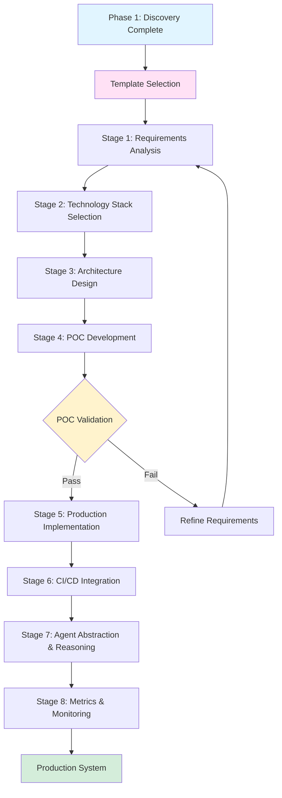

---

## Stage 1: Requirements Analysis

### 1.1 Functional Requirements
Define what the system must do based on the selected template.

**Template A (Centralized) Focus:**
- Global orchestration workflows
- Task decomposition logic
- Departmental agent capabilities
- Approval and compliance flows
- Reporting and audit trails

**Template B (Distributed) Focus:**
- Agent negotiation protocols
- Contract validation rules
- Peer-to-peer communication patterns
- Local autonomy boundaries
- Consensus mechanisms

### 1.2 System Requirements
Specify performance, scalability, and reliability criteria.

| Requirement Type | Template A (Pyramid) | Template B (DAM) |
|-----------------|---------------------|------------------|
| **Latency** | < 500ms orchestrator response | < 2s negotiation cycle |
| **Throughput** | 1000s tasks/hour | 100s contracts/hour |
| **Availability** | 99.9% (hub critical) | 95% (resilient to node failures) |
| **Scalability** | Vertical (powerful orchestrator) | Horizontal (add nodes) |
| **Data Consistency** | Strong consistency | Eventual consistency |

### 1.3 Infrastructure Requirements
Detail the deployment environment and resource needs.

**Common Infrastructure:**
- Compute: Kubernetes cluster or serverless environment
- Storage: Vector databases for RAG, relational DB for state
- Networking: API Gateway, load balancers, service mesh
- Security: SSO integration, secret management, encryption at rest/transit

**Template-Specific:**
- **Template A:** Central message queue (Kafka/RabbitMQ), unified monitoring
- **Template B:** DHT/Registry service, edge compute nodes, peer discovery

### 1.4 CI/CD Integration Requirements
Define automation and deployment pipelines.

- **Source Control:** Git-based workflows (GitHub/GitLab/Bitbucket)
- **Build Pipeline:** Containerization (Docker), artifact management
- **Testing:** Unit, integration, E2E, load testing
- **Deployment:** Blue-green or canary deployments
- **Monitoring:** Observability stack (Prometheus, Grafana, ELK)

---

## Stage 2: Technology Stack Selection

### 2.1 Leverage Sampled Agents & Workflows
Use Phase 1 discoveries to inform technology choices.

**Analysis Inputs:**
1. **Sampled Agent Characteristics:**
   - Programming language preferences (Python, TypeScript, Go, Rust)
   - LLM framework usage (LangChain, LlamaIndex, AutoGen, CrewAI)
   - Existing integrations and tooling

2. **Workflow Patterns:**
   - Synchronous vs asynchronous operations
   - State management approaches
   - Error handling and retry patterns
   - Human-in-the-loop requirements

### 2.2 Technology Decision Matrix

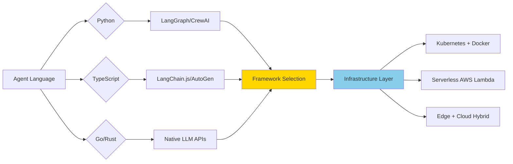

### 2.3 Recommended Stack by Template

**Template A: Centralized Enterprise**
```yaml
orchestration:
  global_orchestrator: LangGraph (Python) or AutoGen (Python/TypeScript)
  task_queue: Temporal.io or Apache Airflow
  
communication:
  message_broker: Apache Kafka or AWS EventBridge
  api_gateway: Kong or AWS API Gateway
  
data:
  vector_db: Pinecone, Weaviate, or Qdrant
  graph_db: Neo4j or TigerGraph (for GraphRAG)
  timeseries_db: InfluxDB or TimescaleDB (for predictive analytics)
  state_db: PostgreSQL with jsonb support
  cache: Redis
  
llm:
  provider: OpenAI GPT-4, Anthropic Claude, or Azure OpenAI
  framework: LangChain with custom chains
  
security:
  identity: Okta, Auth0, or Entra ID
  policy: Open Policy Agent (OPA)
  secrets: HashiCorp Vault or AWS Secrets Manager
```

**Template B: Distributed Mesh**
```yaml
orchestration:
  domain_nodes: Independent LangGraph agents
  coordination: DAPR or custom protocol
  
communication:
  peer_discovery: Consul, etcd, or libp2p
  messaging: gRPC with mutual TLS
  contract_registry: Blockchain light client or distributed DHT
  
data:
  local_vector_db: ChromaDB or local Qdrant
  graph_db: Neo4j Embedded or MemGraph
  timeseries_db: TimescaleDB or local InfluxDB
  domain_db: SQLite or embedded PostgreSQL
  sync: CRDTs or custom conflict resolution
  
llm:
  provider: Local models (Ollama) or hybrid cloud
  framework: LangChain with custom agents
  
security:
  identity: Decentralized IDs (DIDs) or PKI
  policy: Smart contracts or local policy engines
  secrets: Per-node vault or HSM
```

---

## Stage 3: Architecture Design

### 3.1 Component Architecture

**Template A: Centralized Architecture**
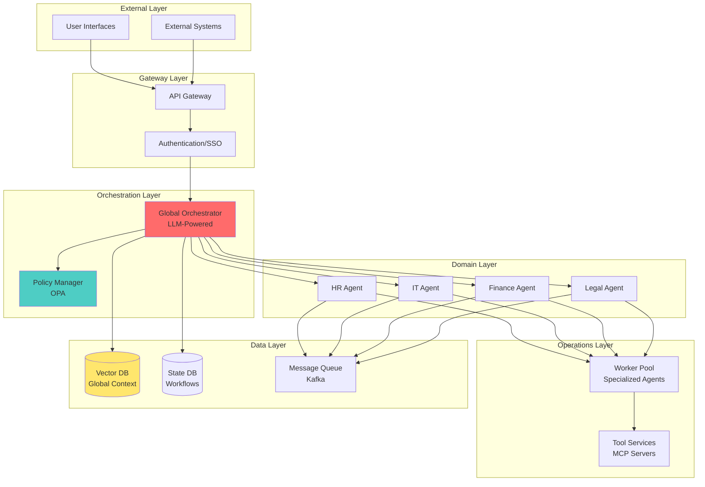

**Template B: Distributed Mesh Architecture**
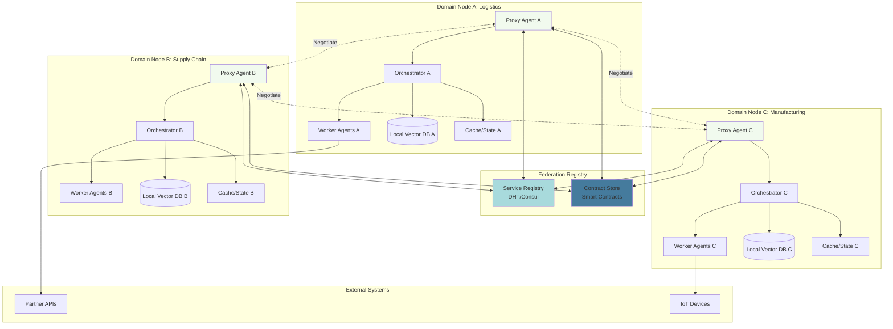

### 3.2 Data Architecture

**Data Flow and Storage Strategy**
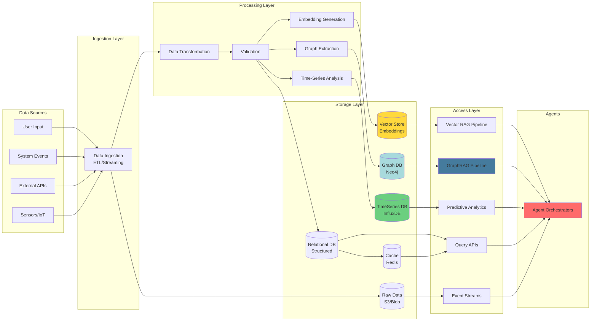

### 3.3 RAG Approaches

**Vector-Based RAG (Traditional):**
- **Embedding models** convert text to vectors
- **Similarity search** finds semantically related content
- **Best for:** Unstructured text, semantic search, Q&A
- **Limitations:** Misses explicit relationships, limited multi-hop reasoning

**GraphRAG (Relationship-Aware):**
- **Knowledge graphs** capture entities and relationships
- **Graph traversal** performs multi-hop reasoning
- **Hybrid queries** combine graph patterns + vector similarity
- **Best for:** Complex research, compliance (multi-document), supply chains
- **Advantages:** Explainable reasoning paths, relationship discovery

**Hybrid RAG (Recommended):**
```python
# Combining Vector + Graph RAG
class HybridRAGPipeline:
    async def retrieve(self, query: str) -> Context:
        # Stage 1: Vector search for initial candidates
        vector_results = await self.vector_db.similarity_search(query, k=20)
        
        # Stage 2: Extract entities from results
        entities = await self.ner.extract(vector_results)
        
        # Stage 3: Graph expansion
        graph_paths = await self.graph_db.expand_entities(
            entities, max_hops=2
        )
        
        # Stage 4: Re-rank combined results
        combined = self._merge_results(vector_results, graph_paths)
        ranked = await self.reranker.rank(query, combined)
        
        return Context(top_k=ranked[:10])
```

### 3.4 Predictive Analytics with TimeSeries

**Use Cases:**
- Demand forecasting
- Anomaly detection
- Predictive maintenance
- Capacity planning
- Trend analysis

**Architecture:**
```python
# Predictive Agent with TimeSeries DB
class TimeSeriesPredictiveAgent:
    def __init__(self, tsdb: InfluxDB, model: MLModel):
        self.tsdb = tsdb
        self.model = model
    
    async def forecast(self, metric: str, horizon: str) -> Forecast:
        # Fetch historical data
        query = f'''
        SELECT mean("{metric}") as value
        FROM measurements
        WHERE time > now() - 90d
        GROUP BY time(1h)
        '''
        historical = await self.tsdb.query(query)
        
        # Feature engineering
        features = self._extract_features(historical)
        
        # ML prediction
        forecast = self.model.predict(features, steps=horizon)
        
        # Confidence intervals
        lower, upper = self._confidence_bounds(forecast)
        
        return Forecast(
            predictions=forecast,
            confidence_lower=lower,
            confidence_upper=upper,
            model_version=self.model.version
        )
```

### 3.5 Artifact Types

| Artifact Type | Description | Storage | Template A | Template B |
|--------------|-------------|---------|-----------|-----------|
| **Agent Definitions** | Agent capabilities, prompts, tools | Git repository | ✓ | ✓ |
| **Workflow Specs** | Task graphs, state machines | Git + DB | ✓ | ✓ |
| **Policy Documents** | Access rules, compliance | Policy store | ✓ (Global) | ✓ (Local) |
| **Training Data** | Example conversations, fine-tuning | S3/Blob + Vector DB | ✓ | ✓ |
| **ML/DL Models** | Predictive models, classifiers | Model registry + TimescaleDB | ✓ | ✓ |
| **Graph Data** | Knowledge graphs for GraphRAG | Neo4j/TigerGraph | ✓ | ✓ |
| **Time-Series Data** | Historical metrics for predictions | InfluxDB/TimescaleDB | ✓ | ✓ |
| **Contracts** | Inter-agent agreements | - | ✗ | ✓ |
| **Metrics/Logs** | Telemetry, traces, audit | Time-series DB | ✓ | ✓ |
| **Models** | LLM weights, embeddings | Model registry | ✓ (Central) | ✓ (Distributed) |
| **Rule Sets** | Deterministic logic for secure agents | Git + Policy Engine | ✓ | ✓ |

---

## Stage 4: POC/Prototype Development

### 4.1 POC Objectives
- **Validate architectural assumptions** from discovery phase
- **Test critical path** through the system (one end-to-end workflow)
- **Assess LLM performance** for reasoning and tool usage
- **Identify integration challenges** early
- **Gather feedback** from stakeholders

### 4.2 Vertical Slice Selection

**Template A: Centralized POC**
Pick one representative workflow:
- Example: "Employee Onboarding"
  - Trigger: HR submits new hire form
  - Orchestrator decomposes into: IT provisioning, payroll setup, compliance training
  - Each sub-agent executes and reports status
  - Final output: Onboarding completion report

**Template B: Distributed POC**
Pick one negotiation scenario:
- Example: "Purchase Order Fulfillment"
  - Trigger: Customer places order
  - Buyer agent negotiates with supplier agent
  - Contract signed via smart contract
  - Logistics agent coordinates delivery
  - Final output: Delivery confirmation

### 4.3 POC Implementation Phases

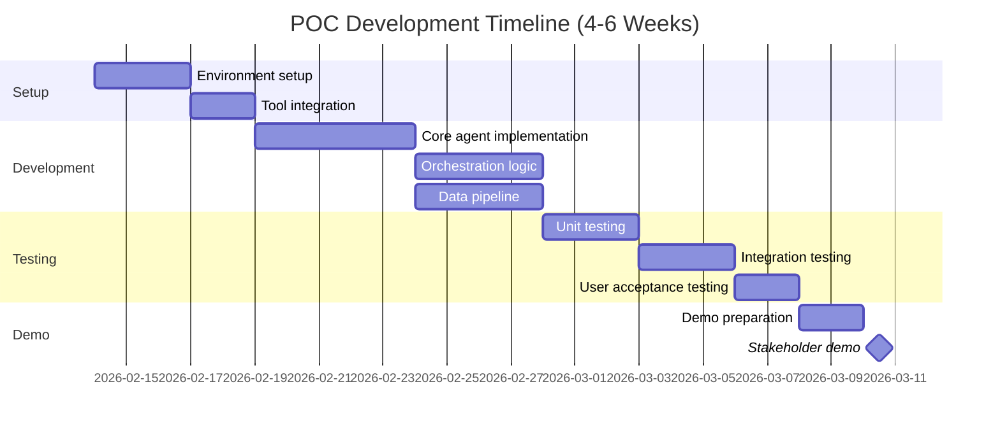

### 4.4 POC Success Criteria

**Functional Criteria:**
- ✓ End-to-end workflow completes successfully
- ✓ Agent reasoning produces correct decisions
- ✓ Tool/API integrations work reliably
- ✓ Error handling gracefully recovers from failures

**Non-Functional Criteria:**
- ✓ Response times meet requirements (see Stage 1.2)
- ✓ LLM costs stay within budget projections
- ✓ System maintains state correctly
- ✓ Security controls validate properly

### 4.5 POC to Production Gap Analysis

After POC validation, document gaps:
1. **Scale gaps:** What breaks at 10x load?
2. **Security gaps:** What additional hardening is needed?
3. **Monitoring gaps:** What observability is missing?
4. **Operational gaps:** What runbooks/procedures are needed?

---

## Stage 5: Production Implementation

### 5.1 Implementation Roadmap

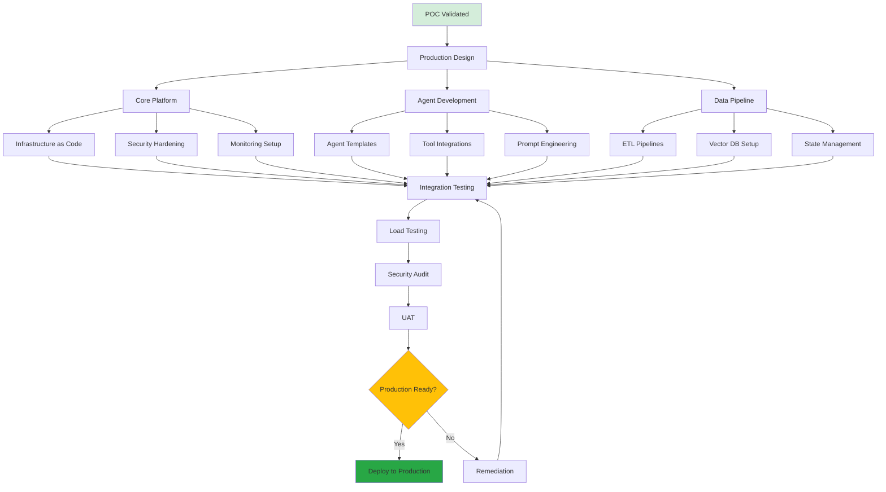

### 5.2 Implementation Checklist

**Infrastructure:**
- [ ] Kubernetes cluster provisioned with auto-scaling
- [ ] Service mesh configured (Istio/Linkerd) if applicable
- [ ] Load balancers and ingress controllers deployed
- [ ] Secrets management integrated
- [ ] Backup and disaster recovery procedures established

**Data Platform:**
- [ ] Vector database deployed and indexed
- [ ] Relational database with replication configured
- [ ] Message queue/event bus operational
- [ ] Data retention and archival policies implemented
- [ ] GDPR/compliance controls enabled

**Agent Platform:**
- [ ] Agent runtime environment deployed
- [ ] LLM API connections configured with rate limiting
- [ ] Tool/MCP servers registered and accessible
- [ ] Agent prompt library versioned in Git
- [ ] Orchestration framework operational

**Security:**
- [ ] SSO/Identity provider integrated
- [ ] API authentication and authorization enforced
- [ ] Network policies and firewalls configured
- [ ] Encryption at rest and in transit enabled
- [ ] Vulnerability scanning automated
- [ ] Security incident response plan documented

**Observability:**
- [ ] Logging infrastructure (ELK/Splunk) deployed
- [ ] Metrics collection (Prometheus) operational
- [ ] Distributed tracing (Jaeger/Zipkin) configured
- [ ] Dashboards created for key metrics
- [ ] Alerting rules defined and tested
- [ ] On-call rotation established

---

## Stage 6: CI/CD Integration

### 6.1 CI/CD Pipeline Architecture

```mermaid
graph LR
    A[Developer commits code] --> B[Git Push]
    B --> C{CI Pipeline}
    
    subgraph "Continuous Integration"
        C --> D[Build & Lint]
        D --> E[Unit Tests]
        E --> F[Security Scan]
        F --> G[Build Container]
        G --> H[Integration Tests]
    end
    
    H --> I{Tests Pass?}
    I -->|No| J[Notify Developer]
    J --> A
    I -->|Yes| K[Push to Registry]
    
    K --> L{CD Pipeline}
    
    subgraph "Continuous Delivery"
        L --> M[Deploy to Dev]
        M --> N[Smoke Tests]
        N --> O[Deploy to Staging]
        O --> P[E2E Tests]
        P --> Q[Load Tests]
    end
    
    Q --> R{Ready for Prod?}
    R -->|No| S[Rollback]
    S --> J
    R -->|Manual Approval| T[Deploy to Prod]
    R -->|Auto-Deploy| T
    
    T --> U[Health Checks]
    U --> V{Healthy?}
    V -->|No| W[Auto Rollback]
    W --> J
    V -->|Yes| X[Monitor Metrics]
    
    style C fill:#4CAF50
    style L fill:#2196F3
    style T fill:#FF9800
```

### 6.2 Testing Strategy

**Test Pyramid:**
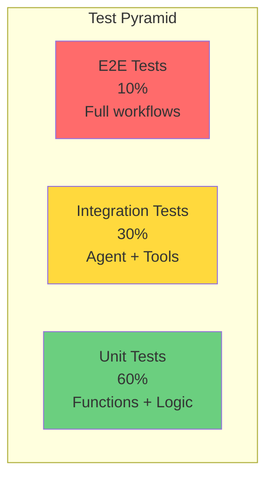

**Test Types by Stage:**

| Test Type | Purpose | Frequency | Template A | Template B |
|-----------|---------|-----------|-----------|-----------|
| **Unit** | Validate individual functions | Every commit | ✓ | ✓ |
| **Integration** | Test agent + tool interactions | Every commit | ✓ | ✓ |
| **Contract** | Verify inter-agent contracts | Every commit | ✗ | ✓ |
| **E2E** | Full workflow validation | Pre-deployment | ✓ | ✓ |
| **Load** | Performance under stress | Weekly | ✓ | ✓ |
| **Chaos** | Resilience testing | Monthly | ✓ (Hub failure) | ✓ (Node failure) |
| **Security** | Vulnerability scanning | Every build | ✓ | ✓ |
| **LLM Quality** | Prompt accuracy/safety | Continuous | ✓ | ✓ |

### 6.3 Deployment Strategies

**Blue-Green Deployment (Template A Recommended):**
- Maintain two identical production environments
- Deploy new version to idle environment
- Switch traffic after validation
- Quick rollback by switching back

**Canary Deployment (Template B Recommended):**
- Deploy new version to subset of nodes
- Monitor metrics for anomalies
- Gradually increase traffic percentage
- Rollback if problems detected

---

## Stage 7: Agent Abstraction & Reasoning Framework

### 7.1 Agent Hierarchy

Based on the agentic architecture, agents are organized into three distinct layers:

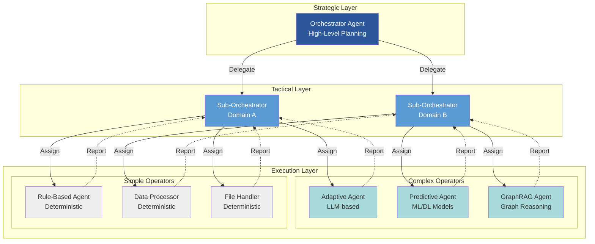

### 7.2 Reasoning Framework: Deterministic vs LLM-Based

**Critical Design Decision:** Agent reasoning capabilities must match security and reliability requirements.

#### Deterministic Agents

**Characteristics:**
- **Rule-based** logic with predefined decision trees
- **No LLM** involvement; zero hallucination risk
- **High security** - immune to prompt injection attacks
- **Predictable** outcomes for given inputs
- **Low latency** - no API calls to LLM services

**Use Cases:**
- High-security orchestrators (financial transactions, healthcare)
- Compliance-critical workflows (audit trails, regulatory reporting)
- Real-time systems (manufacturing, IoT control)
- Data validation and transformation
- Authentication and authorization checks

**Implementation:**
```python
# Example: Deterministic File Processor
class DeterministicFileReader:
    def __init__(self, allowed_extensions: List[str]):
        self.allowed_extensions = allowed_extensions
    
    def process(self, filepath: str) -> Dict:
        # Rule-based validation
        if not self._validate_extension(filepath):
            raise SecurityException("Invalid file type")
        
        # Deterministic processing
        content = self._read_file(filepath)
        metadata = self._extract_metadata(content)
        
        return {
            "status": "success",
            "data": content,
            "metadata": metadata
        }
    
    def _validate_extension(self, filepath: str) -> bool:
        return any(filepath.endswith(ext) for ext in self.allowed_extensions)
```

#### LLM-Based Agents

**Characteristics:**
- **Neural reasoning** with GPT/Claude/Llama models
- **Adaptive** to novel situations
- **Natural language** understanding and generation
- **Context-aware** decision making
- **Requires** prompt engineering and safety guardrails

**Use Cases:**
- Customer service and support
- Content generation and summarization
- Complex problem analysis
- Natural language interfaces
- Creative workflows

**Implementation:**
```python
# Example: LLM-Based Adaptive Agent
class AdaptiveAnalysisAgent:
    def __init__(self, llm_client, safety_filters: List[Filter]):
        self.llm = llm_client
        self.safety_filters = safety_filters
    
    async def analyze(self, query: str, context: Dict) -> Dict:
        # Safety check
        if not self._passes_safety_checks(query):
            return self._fallback_to_deterministic(query)
        
        # Build prompt with context
        prompt = self._build_prompt(query, context)
        
        # LLM reasoning
        response = await self.llm.chat_completion(
            messages=[{"role": "user", "content": prompt}],
            temperature=0.3,
            max_tokens=1000
        )
        
        # Validate response
        if not self._validate_response(response):
            return self._fallback_to_deterministic(query)
        
        return {
            "status": "success",
            "analysis": response.content,
            "reasoning": response.reasoning_trace
        }
```

#### Hybrid Agents (Predictive + ML/DL)

**Characteristics:**
- **Machine learning models** trained on historical data
- **Graph databases** for relationship reasoning (GraphRAG)
- **Time-series analysis** for forecasting
- **Deterministic fallback** when confidence is low
- **Explainable AI** for audit trails

**Use Cases:**
- Predictive maintenance
- Anomaly detection
- Demand forecasting
- Risk assessment
- Resource optimization

**Implementation:**
```python
# Example: Predictive Agent with TimeSeries ML
class PredictiveMaintenanceAgent:
    def __init__(self, model_path: str, timeseries_db: TimeSeriesDB):
        self.model = self._load_model(model_path)
        self.tsdb = timeseries_db
    
    async def predict_failure(self, equipment_id: str) -> Dict:
        # Fetch time-series data
        metrics = await self.tsdb.query(
            equipment=equipment_id,
            metrics=["temperature", "vibration", "pressure"],
            window="7d"
        )
        
        # ML inference
        features = self._extract_features(metrics)
        prediction = self.model.predict(features)
        confidence = self.model.predict_proba(features)
        
        # Deterministic fallback for low confidence
        if confidence < 0.75:
            return self._rule_based_check(metrics)
        
        return {
            "equipment_id": equipment_id,
            "failure_probability": float(prediction),
            "confidence": float(confidence),
            "recommended_action": self._get_action(prediction),
            "time_to_failure": self._estimate_ttf(metrics, prediction)
        }
```

#### GraphRAG Agents

**Characteristics:**
- **Graph databases** (Neo4j, TigerGraph) for knowledge representation
- **Relationship reasoning** beyond vector similarity
- **Multi-hop queries** for complex inference
- **Hybrid retrieval** combining graph traversal + vector search
- **Explainable paths** through knowledge graph

**Use Cases:**
- Research and discovery
- Regulatory compliance (multi-document reasoning)
- Supply chain optimization
- Fraud detection networks
- Knowledge synthesis

**Implementation:**
```python
# Example: GraphRAG Agent
class GraphRAGAgent:
    def __init__(self, graph_db: Neo4jDB, vector_db: VectorDB, llm):
        self.graph = graph_db
        self.vectors = vector_db
        self.llm = llm
    
    async def reason(self, question: str) -> Dict:
        # Step 1: Vector search for relevant entities
        embedding = await self._embed(question)
        similar_entities = await self.vectors.similarity_search(
            embedding, k=10
        )
        
        # Step 2: Graph traversal to find relationships
        cypher_query = """
        MATCH path = (start)-[*1..3]-(end)
        WHERE start.id IN $entity_ids
        RETURN path, relationships(path) as rels
        ORDER BY length(path)
        LIMIT 20
        """
        paths = await self.graph.query(
            cypher_query,
            entity_ids=[e.id for e in similar_entities]
        )
        
        # Step 3: Build context from graph paths
        context = self._build_graph_context(paths)
        
        # Step 4: LLM reasoning over graph context
        prompt = f"""
        Knowledge Graph Context:
        {context}
        
        Question: {question}
        
        Provide a detailed answer based on the relationships and entities in the knowledge graph.
        Cite specific graph paths in your reasoning.
        """
        
        response = await self.llm.chat_completion(prompt)
        
        return {
            "answer": response.content,
            "graph_paths": [self._format_path(p) for p in paths],
            "source_entities": similar_entities,
            "reasoning_trace": response.reasoning_trace
        }
```

### 7.3 Security Considerations

**High-Security Orchestrators:**

For mission-critical or high-security-risk contexts (financial services, healthcare, defense), orchestrators **MUST** use deterministic reasoning:

| Risk Factor | LLM-Based | Deterministic |
|------------|-----------|---------------|
| **Prompt Injection** | ⚠️ Vulnerable | ✅ Immune |
| **Hallucinations** | ⚠️ Possible | ✅ Impossible |
| **Adversarial Attacks** | ⚠️ At Risk | ✅ Resilient |
| **Audit Trail** | ⚠️ Opaque | ✅ Transparent |
| **Compliance** | ⚠️ Uncertain | ✅ Verifiable |
| **Latency** | ⚠️ Variable (API) | ✅ Predictable |

**Recommended Architecture for High-Security:**

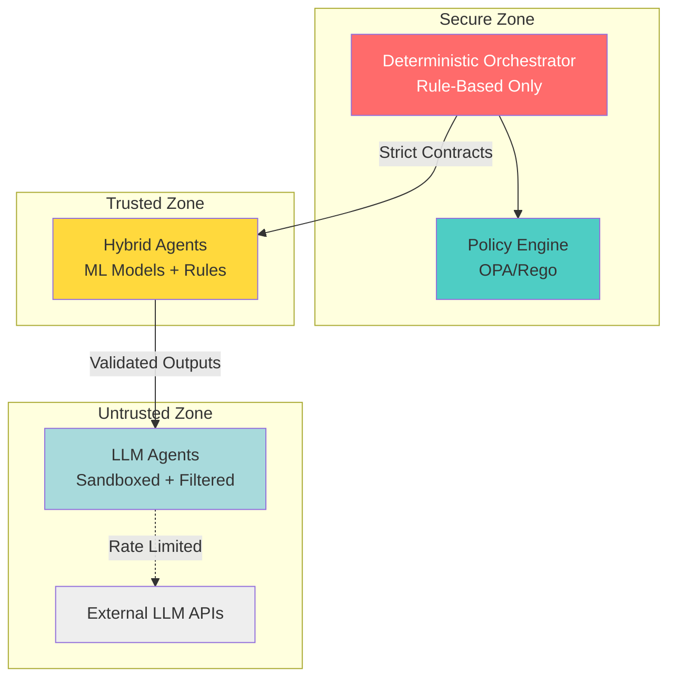

**Security Policy Example:**
```yaml
# High-Security Orchestrator Configuration
orchestrator:
  reasoning_mode: deterministic  # Never use LLM
  max_delegation_depth: 3
  
  allowed_operators:
    - type: deterministic
      risk_level: low
    - type: ml_hybrid
      risk_level: medium
      requires_approval: true
      confidence_threshold: 0.95
    - type: llm_based
      risk_level: high
      blocked: true  # Completely disabled for security
  
  audit:
    log_all_decisions: true
    require_explanation: true
    retain_logs: 7_years
```

### 7.4 Agent Selection Matrix

| Context | Orchestrator | Tactical Agents | Operators |
|---------|-------------|----------------|----------|
| **Financial Trading** | Deterministic | Deterministic + ML | Deterministic |
| **Healthcare Diagnosis** | Deterministic | ML + GraphRAG | LLM (supervised) |
| **Customer Support** | LLM | LLM | LLM + Deterministic |
| **Supply Chain** | Hybrid | ML + GraphRAG | Deterministic |
| **Content Creation** | LLM | LLM | LLM |
| **IoT Control** | Deterministic | ML (Predictive) | Deterministic |
| **Legal Compliance** | Deterministic | GraphRAG | Deterministic |

---

## Stage 8: Metrics & Fitness Assessment

### 8.1 System Health Metrics

**Infrastructure Metrics:**
```yaml
availability:
  - uptime_percentage: 99.9%          # SLA target
  - mean_time_to_recovery: < 15min   # MTTR
  
performance:
  - api_response_time_p95: < 500ms
  - orchestrator_latency_p99: < 2s
  - throughput_requests_per_second: > 100
  
reliability:
  - error_rate: < 0.1%
  - failed_jobs_ratio: < 1%
  - message_queue_lag: < 5s
```

**Agent Performance Metrics:**
```yaml
reasoning:
  - llm_call_success_rate: > 99%
  - avg_reasoning_steps: 3-7
  - tool_selection_accuracy: > 95%
  
efficiency:
  - avg_tokens_per_task: < 10000
  - llm_cost_per_workflow: < $0.50
  - task_completion_time: target ± 20%
  
quality:
  - task_success_rate: > 90%
  - human_intervention_rate: < 10%
  - customer_satisfaction_score: > 4.0/5
```

### 8.2 Business Value Metrics

**ROI Indicators:**
- Time savings vs manual process
- Cost reduction (labor + tooling)
- Error reduction rate
- Process cycle time improvement
- SLA compliance improvement

**Template A Specific:**
- Orchestrator decision accuracy
- Cross-departmental handoff efficiency
- Policy violation detection rate
- Audit compliance percentage

**Template B Specific:**
- Negotiation success rate
- Contract execution time
- Node autonomy preservation
- Network resilience (% uptime during node failures)

### 8.3 Agent Performance by Type

**Deterministic Agents:**
```yaml
performance:
  - execution_time_p99: < 50ms
  - error_rate: < 0.01%
  - rule_coverage: > 99%
  
reliability:
  - uptime: 99.99%
  - false_positive_rate: < 0.1%
  - false_negative_rate: < 0.1%
```

**LLM-Based Agents:**
```yaml
performance:
  - latency_p95: < 2s
  - prompt_injection_blocks: 100%
  - hallucination_rate: < 2%
  
quality:
  - user_satisfaction: > 4.2/5
  - task_success_rate: > 88%
  - safety_filter_activation: < 5%
```

**Predictive Agents (ML/DL):**
```yaml
accuracy:
  - prediction_accuracy: > 90%
  - precision: > 85%
  - recall: > 85%
  - f1_score: > 0.85
  
data:
  - training_data_freshness: < 24h
  - model_drift_detection: enabled
  - retraining_frequency: weekly
```

**GraphRAG Agents:**
```yaml
performance:
  - graph_query_latency_p95: < 500ms
  - multi_hop_reasoning_time: < 3s
  - knowledge_graph_coverage: > 95%
  
quality:
  - relationship_accuracy: > 92%
  - path_relevance_score: > 0.88
  - entity_disambiguation: > 90%
```

### 8.4 Monitoring Dashboard

Create real-time dashboards showing:
1. **System Overview:** Health, throughput, errors
2. **Agent Performance by Type:** 
   - Deterministic: Execution time, rule coverage
   - LLM-Based: Latency, safety violations, costs
   - Predictive: Model accuracy, drift detection
   - GraphRAG: Query performance, knowledge coverage
3. **Security Metrics:** 
   - Prompt injection attempts blocked
   - Deterministic orchestrator uptime
   - LLM fallback activation rate
4. **Business Metrics:** Tasks completed, value delivered
5. **Alerts:** Active incidents, degraded services, security events

---

## Appendix: Reference Implementations

### A.1 Directory Structure

**Template A: Centralized**
```
agentic-lab/
├── infrastructure/
│   ├── terraform/              # IaC for cloud resources
│   ├── kubernetes/             # K8s manifests
│   └── docker/                 # Dockerfiles
├── src/
│   ├── orchestrator/           # Global orchestrator
│   │   ├── deterministic/      # Rule-based orchestrator
│   │   │   ├── rules.py
│   │   │   └── decision_tree.py
│   │   ├── llm_based/          # LLM-powered orchestrator
│   │   │   ├── planning.py
│   │   │   ├── execution.py
│   │   │   └── monitoring.py
│   │   └── hybrid/             # Hybrid approach
│   ├── agents/                 # Domain agents
│   │   ├── hr_agent/
│   │   │   ├── deterministic/  # Rule-based components
│   │   │   └── llm/            # LLM components
│   │   ├── it_agent/
│   │   └── finance_agent/
│   ├── operators/              # Execution layer
│   │   ├── simple/             # Deterministic operators
│   │   │   ├── file_reader.py
│   │   │   ├── data_validator.py
│   │   │   └── api_caller.py
│   │   └── complex/            # Complex operators
│   │       ├── adaptive_llm.py
│   │       ├── predictive_ml.py
│   │       └── graphrag.py
│   └── shared/                 # Common utilities
│       ├── policy/             # OPA policies + rule sets
│       ├── tools/              # MCP servers
│       └── memory/             # Vector + Graph DB clients
├── data/
│   ├── vectors/                # Vector indexes (RAG)
│   ├── graphs/                 # Knowledge graphs (GraphRAG)
│   │   ├── entities/
│   │   ├── relationships/
│   │   └── ontologies/
│   ├── timeseries/             # Historical metrics
│   │   ├── metrics/
│   │   └── predictions/
│   ├── models/                 # ML/DL models
│   │   ├── predictive/
│   │   ├── classifiers/
│   │   └── embeddings/
│   ├── schemas/                # DB schemas
│   └── seeds/                  # Test data
├── tests/
│   ├── unit/
│   ├── integration/
│   ├── e2e/
│   ├── security/               # Prompt injection, adversarial
│   └── performance/            # Load testing
├── ci-cd/
│   ├── .github/workflows/      # GitHub Actions
│   └── scripts/                # Deployment scripts
└── docs/
    ├── architecture/
    ├── agent_taxonomy/         # Agent hierarchy docs
    ├── security/               # Security policies
    ├── runbooks/
    └── api/
```

**Template B: Distributed**
```
agentic-lab/
├── infrastructure/
│   ├── terraform/              # IaC for cloud + edge
│   ├── kubernetes/             # Multi-cluster setup
│   └── docker/                 # Node containers
├── src/
│   ├── registry/               # Service discovery
│   │   ├── dht.py
│   │   └── contracts.py
│   ├── nodes/                  # Domain nodes
│   │   ├── logistics_node/
│   │   │   ├── proxy.py
│   │   │   ├── orchestrator/
│   │   │   │   ├── deterministic.py  # Secure orchestration
│   │   │   │   └── hybrid.py         # ML-enhanced
│   │   │   ├── operators/
│   │   │   │   ├── simple/           # Deterministic
│   │   │   │   └── complex/          # LLM/ML/GraphRAG
│   │   │   └── data/
│   │   │       ├── local_vectors/
│   │   │       ├── local_graphs/
│   │   │       └── timeseries/
│   │   ├── supplier_node/
│   │   │   └── [similar structure]
│   │   └── manufacturing_node/
│   │       └── [similar structure]
│   └── shared/
│       ├── protocols/          # Communication protocols
│       ├── contracts/          # Smart contracts
│       ├── security/           # Deterministic validators
│       └── crypto/             # Security utilities
├── data/
│   ├── node_data/              # Per-node storage
│   │   ├── logistics/
│   │   │   ├── vectors/
│   │   │   ├── graphs/
│   │   │   ├── timeseries/
│   │   │   └── models/         # Local ML models
│   │   ├── supplier/
│   │   │   └── [similar structure]
│   │   └── manufacturing/
│   │       └── [similar structure]
│   └── shared_schemas/         # Contract schemas
├── tests/
│   ├── unit/
│   ├── integration/
│   ├── contract/               # Contract testing
│   ├── security/               # Security validation
│   └── chaos/                  # Resilience testing
├── ci-cd/
│   ├── .github/workflows/
│   └── deployment/
│       ├── central.sh          # Registry deployment
│       └── node.sh             # Node deployment
└── docs/
    ├── protocols/
    ├── contracts/
    ├── agent_taxonomy/         # Agent types per node
    ├── security/               # Security architecture
    └── node_guides/
```

### A.2 Technology Quick Reference

**Languages:**
- Python 3.11+ (async/await, type hints)
- TypeScript 5.0+ (for Node.js agents)
- Go 1.21+ (high-performance proxies)

**Frameworks:**
- LangGraph (Python): Stateful agent workflows
- LangChain (Python/TS): LLM orchestration
- AutoGen (Python/TS): Multi-agent conversations
- CrewAI (Python): Role-based agents

**Infrastructure:**
- Kubernetes 1.28+
- Docker 24+
- Terraform 1.5+
- Consul (service discovery)

**Data:**
- PostgreSQL 15+ (with pgvector)
- Qdrant/Weaviate/Pinecone (vector stores)
- Neo4j/TigerGraph (graph databases)
- InfluxDB/TimescaleDB (time-series databases)
- Redis 7+ (caching)
- Kafka/Pulsar (messaging)

**Observability:**
- Prometheus + Grafana
- OpenTelemetry
- Jaeger (tracing)
- ELK Stack (logging)

---

## Getting Started

1. **Complete Phase 1 Discovery:** Use [Phase1_The_Agentic_Discovery_Playbook.md](./Phase1_The_Agentic_Discovery_Playbook.md)
2. **Select Your Template:** Choose Template A (Centralized) or B (Distributed)
3. **Review Agent Taxonomy:** Understand the hierarchy (Strategic/Tactical/Execution layers)
4. **Assess Security Requirements:** Determine if deterministic orchestrators are required
5. **Choose RAG Approach:** Select Vector RAG, GraphRAG, or hybrid based on use case
6. **Follow Implementation Stages:** Progress through Stages 1-8 systematically
7. **Build POC:** Validate assumptions with a minimal vertical slice
8. **Iterate to Production:** Expand POC into full production system
9. **Monitor & Optimize:** Continuously improve based on metrics

**Key Decision Points:**
- **High-Security Contexts** (finance, healthcare, defense): Use deterministic orchestrators + rule-based agents
- **Complex Reasoning** (research, compliance): Implement GraphRAG + predictive analytics
- **Customer-Facing** (support, content): LLM-based agents with safety guardrails
- **Hybrid Scenarios**: Mix deterministic and LLM agents with clear security boundaries

---

## Next Steps

- Review the [Phase1_The_Agentic_Discovery_Playbook.md](./Phase1_The_Agentic_Discovery_Playbook.md) for template selection guidance
- Create detailed requirements document using Stage 1 framework
- Set up project repository with appropriate directory structure
- Schedule kickoff meeting with stakeholders to align on POC scope

---

## Support & Resources

**Documentation:**
- LangChain: https://python.langchain.com
- LangGraph: https://langchain-ai.github.io/langgraph/
- MCP Documentation: https://modelcontextprotocol.io
- Neo4j (GraphRAG): https://neo4j.com/developer/
- InfluxDB (TimeSeries): https://docs.influxdata.com/

**Agent Hierarchy Reference:**
- See [specs/agents-hierarchy.svg](./agents-hierarchy.svg) for visual taxonomy
- Strategic Layer: Orchestrator agents
- Tactical Layer: Sub-orchestrators by domain
- Execution Layer: Simple (deterministic) and Complex (LLM/ML/GraphRAG) operators

**Security Resources:**
- OWASP LLM Top 10: https://owasp.org/www-project-top-10-for-large-language-model-applications/
- Prompt Injection Defense: Best practices for secure LLM orchestration
- Deterministic Architecture Patterns: Rule-based systems for high-risk contexts

**Community:**
- Agentic AI Discord/Slack channels
- Framework-specific forums and GitHub discussions

**Professional Services:**
- Architecture review and consultation
- POC development assistance
- Production deployment support
- Agent taxonomy design for specific domains

---

## Key Innovations in This Framework

### 🎯 Agent Abstraction Hierarchy
This framework introduces a **three-layer agent taxonomy** (Strategic/Tactical/Execution) that explicitly supports:
- **Deterministic agents** for high-security, zero-hallucination contexts
- **LLM-based agents** for adaptive, natural language workflows
- **Predictive agents** using ML/DL models trained on time-series data
- **GraphRAG agents** for complex relationship reasoning

### 🔒 Security-First Design
Unlike generic agentic frameworks, this approach mandates **deterministic orchestrators** for high-risk domains:
- Financial services
- Healthcare
- Defense/aerospace
- Regulatory compliance

This eliminates prompt injection, hallucinations, and adversarial attacks where they matter most.

### 🧠 Advanced Reasoning Options
- **Vector RAG**: Traditional semantic search over documents
- **GraphRAG**: Multi-hop reasoning over knowledge graphs (Neo4j/TigerGraph)
- **Hybrid RAG**: Combines vector similarity + graph traversal for best of both worlds
- **Predictive Analytics**: Time-series forecasting using ML/DL models (InfluxDB/TimescaleDB)

### 📊 Production-Ready Observability
Built-in monitoring for:
- Agent performance **by reasoning type** (deterministic vs LLM vs predictive)
- Security metrics (prompt injection attempts, safety filter activations)
- Model drift detection for ML-based agents
- GraphRAG query performance and knowledge coverage

### 🏗️ Template-Specific Implementation
Provides complete directory structures, technology stacks, and deployment patterns for:
- **Template A**: Centralized enterprise systems
- **Template B**: Distributed mesh architectures

---

*Document Version: 1.0*  
*Last Updated: February 14, 2026*  
*Maintained by: Agentic Workflow Implementation Team*
